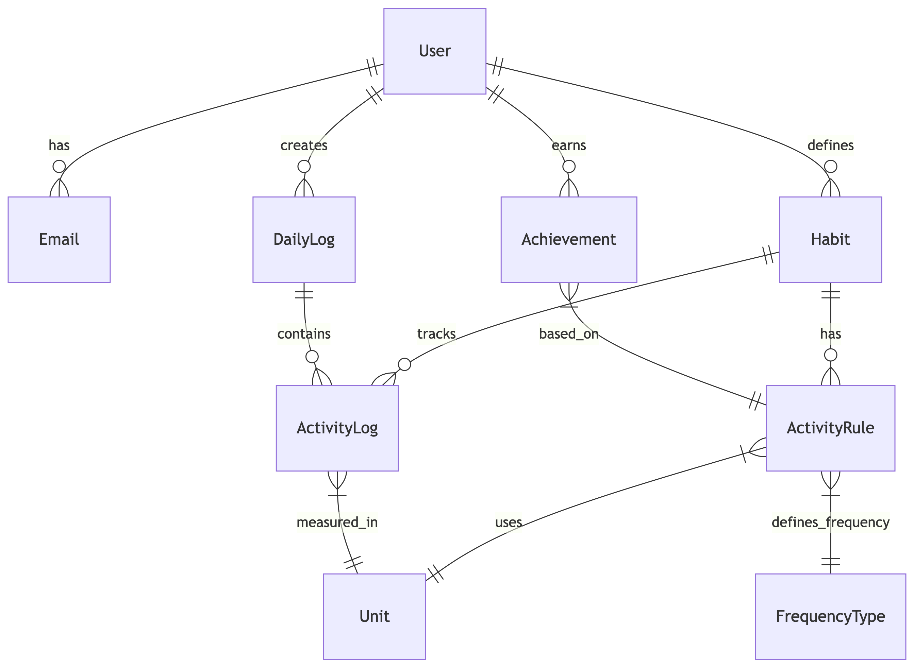

# Estructura de la Base de Datos

## Diagrama Entidad-Relación

## Tablas Principales

### User
Almacena la información básica de los usuarios.
- `id`: Identificador único del usuario
- `name`: Nombre del usuario
- `password_hash`: Hash de la contraseña (BCrypt)
- `created_at`: Fecha de creación de la cuenta
- `last_activity_date`: Última fecha de actividad

### Email
Gestiona múltiples correos por usuario.
- `id`: Identificador único del email
- `email`: Dirección de correo electrónico
- `user_id`: ID del usuario asociado
- `is_main`: Indica si es el correo principal

### Habit
Registra los hábitos de los usuarios.
- `id`: Identificador único del hábito
- `name`: Nombre del hábito
- `user_id`: Usuario al que pertenece
- `created_at`: Fecha de creación

### DailyLog
Registro diario de actividades.
- `id`: Identificador único del registro
- `user_id`: Usuario asociado
- `date`: Fecha del registro

### Unit
Unidades de medida para las actividades.
- `id`: Identificador único
- `name`: Nombre de la unidad (ej: litros, kilómetros)

### FrequencyType
Tipos de frecuencia para las reglas.
- `id`: Identificador único
- `name`: Tipo de frecuencia (diaria, semanal, etc.)

### ActivityRule
Reglas para los hábitos.
- `id`: Identificador único
- `habit_id`: Hábito asociado
- `target_value`: Valor objetivo
- `unit_id`: Unidad de medida
- `frequency_id`: Tipo de frecuencia
- `target_days`: Días objetivo (para rachas)

### ActivityLog
Registro de actividades específicas.
- `id`: Identificador único
- `daily_log_id`: Registro diario asociado
- `habit_id`: Hábito registrado
- `unit_id`: Unidad de medida
- `value`: Valor registrado

### Achievement
Logros obtenidos por los usuarios.
- `id`: Identificador único
- `user_id`: Usuario que obtuvo el logro
- `activity_rule_id`: Regla cumplida
- `earned_date`: Fecha de obtención

## Índices

Se han creado los siguientes índices para optimizar el rendimiento:
- `idx_email_user`: Búsqueda de emails
- `idx_habit_user`: Hábitos por usuario
- `idx_dailylog_user_date`: Registros diarios por usuario y fecha
- `idx_activityrule_habit_frequency`: Reglas por hábito y frecuencia
- `idx_activitylog_composite`: Búsqueda de registros de actividad
- `idx_dailylog_date`: Búsqueda por fecha
- `idx_activitylog_value`: Búsqueda por valor 